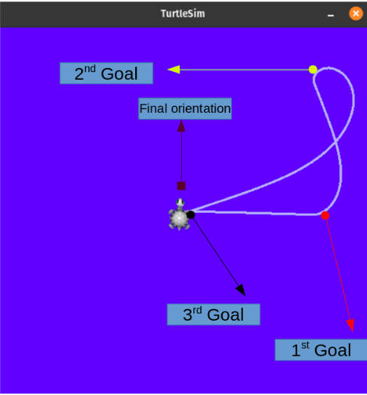
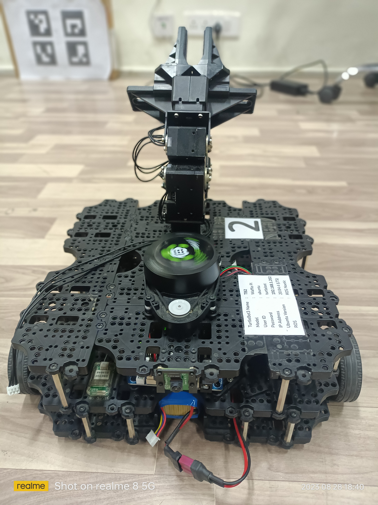
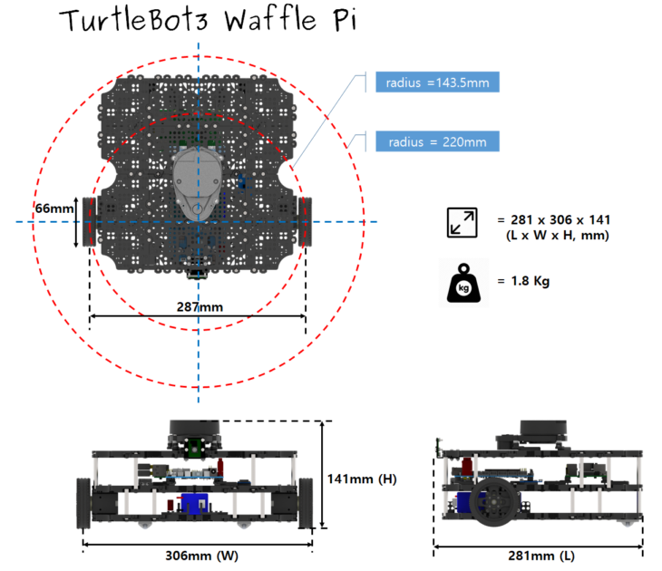

# Experimental Robotics

This repository showcases the practical implementation of robotics concepts, encompassing hardware and software components. It comprises six distinct experiments that delve into various aspects of robotics. The experiments covered are as follows:

1. Introduction to ROS.
2. Control of Turtlebot3.
3. Control of Open Manipulator X.
4. End Effector and Trajectory Control of Open Manipulator X.
5. Jacobian-based Control of the End Effector of Open Manipulator X.

## Introduction to ROS

### Task A: Running TurtleSim with Linear and Angular Velocities

To initiate TurtleSim simulation with linear and angular velocities as inputs, follow these steps:

1. Open two separate Linux terminals.
2. Run the following commands in the respective terminals:

    ```
    $ roscore
    $ rosrun turtlesim turtlesim_node
    ```

3. In the second terminal, execute:

    ```
    $ rostopic pub /turtle1/cmd_vel geometry_msgs/Twist -r 1 -- '[2.0, 0.0, 0.0]' '[0.0, 0.0, 1.5]'
    ```

    This command publishes velocity commands at a rate of 1 Hz, with a linear velocity of 2 m/sec in the x-direction and an angular velocity of 1.5 rad/sec.

### Task B: Custom Code for Position Control of TurtleSim

To move TurtleSim to a desired position, a custom code is provided. See the solutions for both Python and C++ implementations:

- [Desired Position (Python)](./Solutions/p1_B.py)
- [Desired Position (C++)](./Solutions/p1_B.cpp)

[](https://youtu.be/HcosdPP8wzU) </br>
[!Video Demo](https://youtu.be/HcosdPP8wzU)

### Task C: Custom Service and Client Nodes

Implement a custom service and client node where the client requests basic calculations from the server:

- [Client](./Solutions/p1_C_client.py)
- [Server](./Solutions/p1_C_server.py)

### Task D: Creating a ROS Package

Learn how to create a ROS package manually, without using the "catkin_create_pkg" command:

- [Documentation](https://wiki.ros.org/ROS/Tutorials/Creating%20a%20Package%20by%20Hand)
- [CMakeLists.txt](./Solutions/p1_D_CMakeLists.txt)
- [package.xml](./Solutions/p1_D_package.xml)

## Control of TurtleBot3
This section showcases both software and hardware experiments conducted using the TurtleBot3 Waffle Pi model.
<p align="center">
  
  
</p>


### Task A: Turtlebot3 go to goal behaviour
Proportional control is employed to navigate the TurtleBot to the target destination. The error function determines the Euclidean distance between the current and desired positions. This calculation is then utilized to generate commands for linear velocity, while the heading error generates commands for angular velocity.

- [Desired Position Turtlebot3 (Python)](./Solutions/p2_A.py)
- [Gazebo Demo](https://youtu.be/yXdrSMCH6bc?si=o5aFc6ktw7Vzj2j9)
- [Hardware demo](https://youtu.be/3eyBTtrQq4s?si=pv40xWlaliROBVCU)

### Task B: Create a map of Robotocs Lab using SLAM.
The SLAM (Simultaneous Localization and Mapping) is a technique to draw a map by estimating the current location in an arbitrary space. The SLAM is a well-known feature of TurtleBot from its predecessors. The video here shows you how accurately TurtleBot3 can draw a map with its compact and affordable platform.

- [Hardware demo](https://youtu.be/9RfMekVuCm8?si=XXrijLtRvkNQkLUH)

### Task C: Navigate in the custom map.
Navigation is to move the robot from one location to the specified destination in a given environment. For this purpose, a map that contains geometry information of furniture, objects, and walls of the given environment is required. As described in the previous SLAM section, the map was created with the distance information obtained by the sensor and the pose information of the robot itself.

- [Hardware demo](https://youtu.be/9RfMekVuCm8?si=xEIV6hARk5CFWpOC)

### Task D: Navigate in the custom map and teleoperate fake node.

- [Gazebo Demo](https://youtu.be/yXdrSMCH6bc?si=o5aFc6ktw7Vzj2j9)
- [Navigation and Fake Node demo](https://youtu.be/OcAFxgH_zMk?si=cJmfw1OG8GhyXTCp)

  


