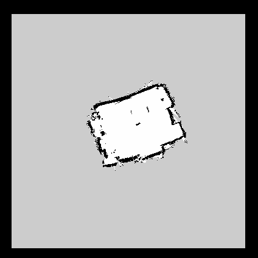
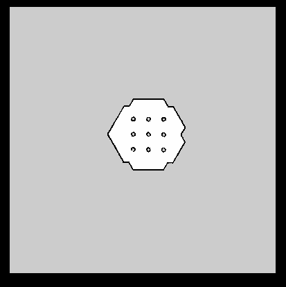

# Experimental Robotics

This repository showcases the practical implementation of robotics concepts, encompassing hardware and software components. It comprises six distinct experiments that delve into various aspects of robotics. The experiments covered are as follows:

1. Introduction to ROS.
2. Control of Turtlebot3.
3. Control of Open Manipulator X.
4. End Effector and Trajectory Control of Open Manipulator X.
5. Jacobian-based Control of the End Effector of Open Manipulator X.

## Introduction to ROS

### Task A: Running TurtleSim with Linear and Angular Velocities

To initiate TurtleSim simulation with linear and angular velocities as inputs, follow these steps:

1. Open two separate Linux terminals.
2. Run the following commands in the respective terminals:

    ```
    $ roscore
    $ rosrun turtlesim turtlesim_node
    ```

3. In the second terminal, execute:

    ```
    $ rostopic pub /turtle1/cmd_vel geometry_msgs/Twist -r 1 -- '[2.0, 0.0, 0.0]' '[0.0, 0.0, 1.5]'
    ```

    This command publishes velocity commands at a rate of 1 Hz, with a linear velocity of 2 m/sec in the x-direction and an angular velocity of 1.5 rad/sec.

### Task B: Custom Code for Position Control of TurtleSim

To move TurtleSim to a desired position, a custom code is provided. See the solutions for both Python and C++ implementations:

- [Desired Position (Python)](./Solutions/p1_B.py)
- [Desired Position (C++)](./Solutions/p1_B.cpp)

</br>
[Video Demo](https://youtu.be/HcosdPP8wzU)

### Task C: Custom Service and Client Nodes

Implement a custom service and client node where the client requests basic calculations from the server:

- [Client](./Solutions/p1_C_client.py)
- [Server](./Solutions/p1_C_server.py)

### Task D: Creating a ROS Package

Learn how to create a ROS package manually, without using the "catkin_create_pkg" command:

- [Documentation](https://wiki.ros.org/ROS/Tutorials/Creating%20a%20Package%20by%20Hand)
- [CMakeLists.txt](./Solutions/p1_D_CMakeLists.txt)
- [package.xml](./Solutions/p1_D_package.xml)

## Control of TurtleBot3

This section highlights a combination of software and hardware experiments executed using the TurtleBot3 Waffle Pi model.

<div align="center">
  
  
</div>

### Task A: Navigating TurtleBot3 using Proportional Control

This task employs proportional control to guide the TurtleBot to a designated destination. The error function computes the Euclidean distance between the current and target positions, serving as the foundation for generating linear velocity commands. Simultaneously, heading error calculates angular velocity commands.

- [Python Code: TurtleBot3 Desired Position](./Solutions/p2_A.py)
- [Gazebo Demonstration](https://youtu.be/yXdrSMCH6bc?si=o5aFc6ktw7Vzj2j9)
- [Hardware Demonstration](https://youtu.be/3eyBTtrQq4s?si=pv40xWlaliROBVCU)

### Task B: Creating a Robotics Lab Map using SLAM

This task introduces SLAM (Simultaneous Localization and Mapping), a technique that constructs maps by estimating current locations in a given space. TurtleBot3's proficiency in SLAM is showcased as it accurately maps a compact and cost-effective platform.



- [Hardware Demonstration](https://youtu.be/9RfMekVuCm8?si=XXrijLtRvkNQkLUH)

### Task C: Navigating within a Custom Map

Navigation involves moving the robot from one point to another in a designated environment. Achieving this requires a map containing spatial information about furniture, objects, and walls. The map is generated through SLAM, utilizing sensor distance data and robot pose information.

- [Hardware Demonstration](https://youtu.be/9RfMekVuCm8?si=xEIV6hARk5CFWpOC)

### Task D: Navigating within a Custom Map and Teleoperating a Simulated Node



- [Gazebo Demonstration](https://youtu.be/yXdrSMCH6bc?si=o5aFc6ktw7Vzj2j9)
- [Navigation and Fake Node Demonstration](https://youtu.be/OcAFxgH_zMk?si=cJmfw1OG8GhyXTCp)


  
## Control of OpenManipulator-X


- OpenMANIPULATOR-X is based on ROS ​and OpenSource. ROS official hardware platform, TurtleBot series has been supporting “TurtleBot Arm”. The OpenMANIPULATOR-X has full hardware compatibility with TurtleBot3​. Users can also control it more easily by adopting the MoveIt! package. Even if you do not have an actual robot, you can control the robot in the Gazebo simulator​.

### Objective - 1: Connecting the Robot with a computer using U2D2 and Learning basic operations on the Robot using existing packages

- In the Linux(Ubuntu platform) environment, USB latency time is set to 16ms by default. Follow the steps below to set the communication latency time to the lowest value (1ms) between DYNAMIXELs and PCs connected via USB.

1. Open a terminal window.

2. Run the ROS core with the following command:

    ```bash
    $ roscore
    ```

   This command initializes the ROS master, which is essential for ROS communication.


3. Open a new terminal window.

4. To change the USB latency to 1 ms, use the following commands:

    ```bash
    $ rosrun open_manipulator_controller create_udev_rules
    $ cat /sys/bus/usb-serial/devices/ttyUSB0/latency_timer
    ```

   The first command configures the USB rules for your device, and the second command displays the current USB latency timer value for `ttyUSB0`.

 

